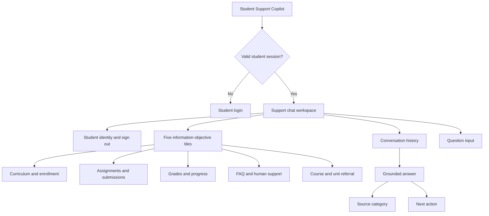
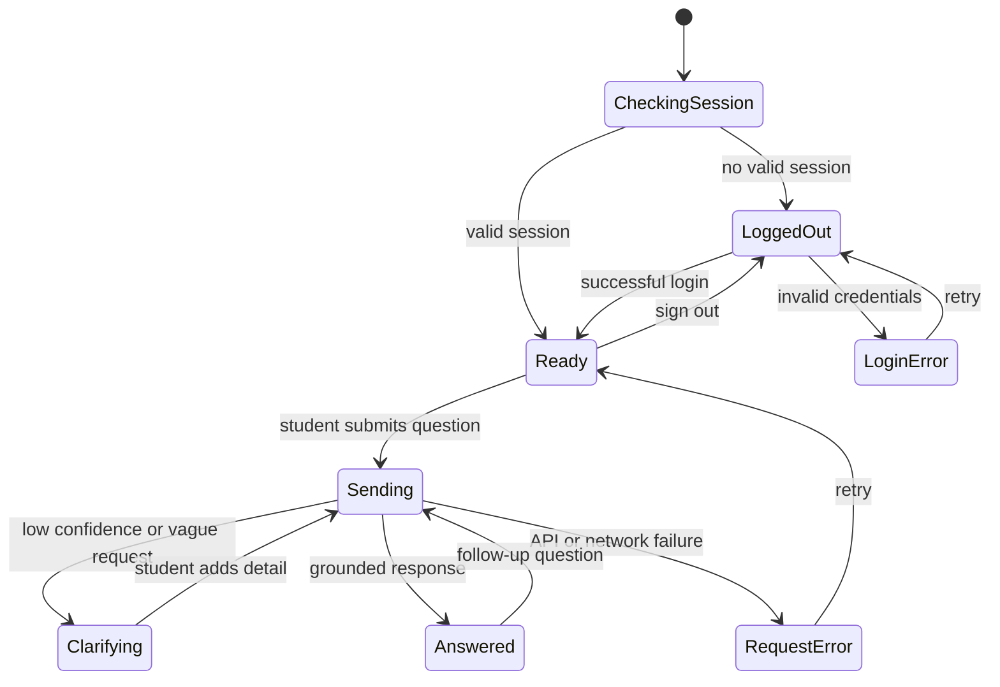

# Student Support Copilot — Information Architecture

## IA objective

Give an authenticated student one clear entry point to trusted LMS information while keeping personalized records, operational guidance, and academic course content logically separated.

## Student-facing structure



## Primary navigation model

The prototype uses a **single-workspace conversational model**, not a multi-page chatbot site.

1. **Authentication gate**
   - Session check
   - Student login
   - Invalid-credential state

2. **Student support workspace**
   - Signed-in student identity
   - Scope statement
   - Five selectable information-objective tiles
   - Objective-specific examples and composer placeholder
   - Conversation thread
   - Message composer
   - Sign out

3. **Response anatomy**
   - Direct answer or bounded refusal
   - Relevant record details
   - Source category
   - Recommended next action

## Conversation taxonomy

### 1. Curriculum and enrollment

**Student questions**

- What is in Grade 7 Mathematics?
- Which courses am I enrolled in?
- What is my pathway?

**Information objects**

- Program
- Semester or grade
- Course/module
- Unit
- Topic
- Enrollment relationship

**Source:** curriculum catalog and authenticated enrollment record.

### 2. Assignments and submissions

**Student questions**

- What is due?
- Have I submitted this assignment?
- Have I taken any assignments yet?

**Information objects**

- Assignment
- Course/module relationship
- Due date and time
- Relative date window and days remaining
- Assignment type
- Submission state
- Submission timestamp
- Score or score-pending state

**Source:** assignment roster and student submission record.

### 3. Grades and progress

**Student questions**

- What are my grades?
- How am I progressing?
- What is my progress in SSC-G7-MATH-ALG?

**Information objects**

- Student overview
- GPA
- Academic standing
- Course grade
- Score percentage
- Completion percentage
- Course status
- Last activity

**Source:** authenticated student grade and progress record.

### 4. Operational FAQ and human routing

**Student questions**

- How do I change my section?
- Who handles medical leave?
- Who should I contact about a grade dispute?

**Information objects**

- FAQ entry
- Process
- Policy source
- Support topic
- Staff role
- Contact channel
- Escalation notes

**Source:** approved handbook/FAQ and mentor routing directory.

### 5. Course and unit referral

**Student questions**

- What does photosynthesis mean?
- Explain equivalent fractions.
- Solve this equation.

**Information objects**

- Detected topic
- Matching course code
- Course title
- Catalog block
- Enrollment status
- Learning location
- Instructor escalation

**Source:** approved course topic map.

This branch never returns definitions, explanations, worked solutions, or tutoring content.

## Content hierarchy

```text
Tenant / school
└── Student session
    ├── Identity
    ├── Enrollments
    │   └── Course / module
    │       ├── Unit / catalog block
    │       ├── Topics
    │       ├── Assignments
    │       │   └── Student submission
    │       └── Student grade and progress
    └── Shared support content
        ├── Operational FAQ
        └── Mentor / escalation route
```

## Intent-to-information map

| Intent | Primary information | Student scope | Response behavior |
|--------|---------------------|---------------|-------------------|
| `curriculum` | Programs, modules, topics, enrollments | Enrollment-aware | Show catalog or own courses |
| `deadline` | Assignments and submissions | Required | Show due and current status |
| `grades` | Grades and progress | Required | Show own record only |
| `faq` | Approved operational guidance | Shared tenant content | Give process and source |
| `mentor` | Support ownership and contact route | Shared tenant content | Give role, channel, next step |
| `subject_doubt` | Topic-to-course mapping | Enrollment-aware | Refer; never teach |
| `unknown` | No content retrieved | Not applicable | Bounded fallback and escalation |

The selected objective is a contextual hint, not an authorization or hard-routing override.
Explicit detected intent, off-topic detection, and safety policies take precedence.

## State model



## Retrieval and response hierarchy

1. Authenticate the student.
2. Normalize slang, typos, fragments, and supported code-switched language locally.
3. Optionally request structured LLM understanding: normalized text, intent hints, course/topic
   hints, confidence, and clarification need.
4. Validate all LLM fields and fall back deterministically if output is malformed or unavailable.
5. Apply raw-text distress, off-topic, academic-integrity, and multi-intent checks.
6. Retrieve only the information objects required by validated intents.
7. Apply enrollment or student-record scope.
8. Build a concise grounded answer and attach source and next action.
9. If data is missing, return an unavailable state and escalation rather than unrelated content.

## Labeling recommendations

Use student language in the interface:

- **My courses**, not “curriculum entity retrieval”
- **Assignments**, not “assessment objects”
- **Grades & progress**, not “performance analytics”
- **Get support**, not “mentor routing”
- **Find where a topic is taught**, not “subject doubt”

Internal intent and response-mode metadata remain server-side and are not shown in the student UI.

## Production IA evolution

- Add deep links from answers to the exact LMS course, assignment, gradebook, or support page.
- Group conversation starters under **My learning**, **My work**, and **Get support**.
- Add a persistent **Sources and privacy** explanation.
- Store FAQ ownership and review dates as content metadata.
- Add role-specific IA only when parent, instructor, or administrator products are separately defined; do not mix their information into the student workspace.
