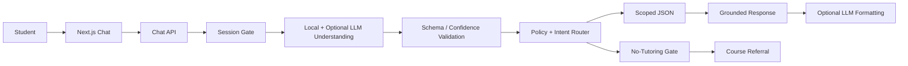

# Student Support Copilot

## Slide 1 — The problem and hypothesis

**Students do not need another tutor. They need a reliable way to navigate their LMS.**

- Curriculum, deadlines, submission status, grades, progress, FAQs, and support ownership are fragmented.
- Students lose time; instructors and support teams answer repetitive questions.
- Hypothesis: one authenticated, grounded entry point can improve self-service without weakening academic integrity.

**Product:** a student navigation and information copilot, not an academic tutor.

---

## Slide 2 — Persona and jobs to be done

**Primary persona hypothesis:** Priya, a logged-in Grade 7 student using the LMS on desktop.

Priya wants to:

1. see what she is enrolled in;
2. know what is due and what she submitted;
3. understand her grades and progress;
4. find the right process or person; and
5. locate where a concept is taught without receiving the answer.

**Validation status:** workflow-informed hypothesis; primary research is the next step.

---

## Slide 3 — Scope, boundaries, and trust

**MVP**

- Own curriculum and enrollments
- Own assignments, deadlines, and submission status
- Own grades and course progress
- Approved FAQs and mentor routing
- Concept/term → exact course/unit referral

**Hard boundaries**

- Authenticated students only
- No tutoring, definitions, homework solving, or open-web answers
- No parent/admin bot or LMS write actions
- Missing data is disclosed; factual answers name their source

---

## Slide 4 — Key flows and safety behavior

**Five supported journeys**

1. Curriculum and course enrollment
2. Deadlines and submission status
3. Grades and progress
4. FAQ and human routing
5. Terminology-to-course referral

**Example safety flow**

> “What does photosynthesis mean?”

`subject_doubt` → topic map → `SSC-G7-SCI-BIO — Living Systems & Cells` → enrollment check → open course / ask instructor

No definition or explanation is generated.

---

## Slide 5 — Architecture and MVP trade-offs

**Technical judgment**

- Local JSON is a transparent one-day substitute for LMS APIs.
- Structured data uses direct retrieval, not vector similarity.
- The optional LLM interprets language and formats approved facts; validated hints are not the source of truth.
- Core tasks continue when the LLM is unavailable.

---

## Slide 6 — Measurement and risk

**North star:** supported task success rate across the five journeys.

**Prototype targets**

- Intent accuracy ≥90%
- Course-referral accuracy ≥95%
- Personalized-data accuracy 100%
- Zero tutoring explanations

**Release guardrails**

- Cross-student data leakage = 0
- Incorrect personalized grade/deadline answers = 0
- Anonymous personalized responses = 0

Critical controls are server-side session scoping, deterministic policy routing, and source labels.

---

## Slide 7 — Evidence from the working prototype

**Automated product-policy evaluation:** 34 / 34 passed.

Coverage includes:

- happy paths, slang, typo, and Hindi-English phrasing;
- curriculum, assignments, grades, FAQ, and mentor routing;
- enrolled and non-enrolled topic referral;
- homework-solve refusal;
- off-topic decline, clarification, capability help, and distress routing;
- multi-intent and malformed-LLM handling;
- cross-student session scoping.

**Additional verification**

- Anonymous `POST /api/chat` returns `401`.
- TypeScript check passes.
- IDE diagnostics report no linter errors.

**Demo:** login → curriculum → assignments → progress → topic referral → logout/auth rejection.

---

## Slide 8 — Prototype vs production roadmap

**Implemented prototype**

- Next.js chat UI and API
- Material UI objective-based chat experience
- Demo cookie login
- Enrollment-scoped JSON
- Local slang/Hindi-English normalization
- Validated structured OpenAI understanding with deterministic fallback
- Relative-date, multi-intent, clarification, off-topic, and distress handling
- Deterministic policy gates and optional grounded OpenAI formatting
- Evaluation suite

**Production recommendation**

1. Validate top intents with students and student-success staff.
2. Replace cookie/JSON with Keycloak/OIDC and typed LMS APIs.
3. Add admin-owned FAQ/routing content and observability.
4. Pilot one cohort with quality review and guardrails.
5. Expand only after accuracy, privacy, and usefulness targets hold.

**Decision requested:** approve a limited cohort discovery and pilot, not a broad AI launch.
