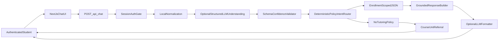

# Student Support Copilot — Technical Strategy, Risks, and Metrics

## Architecture decision

The prototype uses a hybrid architecture: local normalization and optional validated LLM
understanding handle human language, while deterministic policy gates and local JSON retrieval
control what may be answered. Grades, deadlines, submissions, enrollments, and routing entries are
structured records and never depend on model-generated facts.



## Prototype stack and rationale

| Layer | Prototype choice | Product rationale |
|------|------------------|-------------------|
| UI | Next.js App Router, React, TypeScript, Material UI | Fast, typed, responsive demo surface with a reusable component system |
| Authentication | HTTP-only demo cookie | Demonstrates authenticated-only behavior without production identity integration |
| API | `POST /api/chat` | Keeps policy and data access server-side |
| Orchestration | Validated LLM language understanding + deterministic policy/intent fallback | Handles slang, typos, multilingual phrasing, and ambiguity without trusting the LLM as a data source |
| Retrieval | Enrollment-scoped JSON | Transparent demo data and easy inspection |
| Generation | Deterministic formatter; optional OpenAI | Core tasks work without external API; LLM may interpret language and improve grounded wording |
| Observability | Structured server log per chat turn | Establishes event contract for production analytics |

## Data-source decisions

### Structured data: direct lookup

Use authoritative APIs or records for:

- authentication and student identity;
- enrollments;
- assignment deadlines and submissions;
- grades and progress;
- mentor routing.

These require exact filtering, not vector similarity.

### Document knowledge: retrieval only when necessary

Vector retrieval may be appropriate later for large, approved handbooks or policy documents. It should not be used as the source of truth for grades, progress, deadlines, or enrollment.

### Concept referral

The prototype uses an explicit topic-to-course map. In production this should be generated from approved curriculum metadata, reviewed by instructors, and queried with enrollment-aware ranking.

### LLM responsibility boundary

The optional LLM returns a validated JSON interpretation containing normalized text, intent hints,
course/topic hints, confidence, and clarification need. Unknown
intents are discarded, confidence is clamped, and hints cannot bypass authentication, enrollment,
off-topic, distress, or no-tutoring policies. The same model may format approved snippets, but it
does not originate student facts.

## Production evolution

1. Replace the demo cookie with the organization’s signed OIDC/SSO session.
2. Replace JSON with typed LMS APIs for enrollments, assignments, submissions, grades, and progress.
3. Add a policy/routing service for FAQ ownership, escalation, and academic-integrity rules.
4. Add event analytics, evaluation dashboards, and human review.
5. Add semantic retrieval only for approved long-form policy content.
6. Add an approved AI data-processing boundary: redact sensitive fields or use deterministic
   formatting for grades and submissions where required.
7. Pilot with one cohort before broad release.

## Key risks and mitigations

| Risk | Severity | Mitigation | Release guardrail |
|------|----------|------------|-------------------|
| Cross-student data exposure | Critical | Server session identity; no student ID in client request; authorization tests | Zero leakage |
| Incorrect grade/deadline | Critical | Direct structured source; source labels; no inference | Zero known incorrect personalized answers |
| Academic explanation slips through | High | Intent-first policy gate; deterministic referral; policy evaluation set | Zero teaching responses in test set |
| Stale FAQ or routing | Medium | Named content owner, review date, fallback to Student Success | 100% entries have owner/review date in production |
| Wrong topic-to-course match | Medium | Exact-topic priority, enrollment boost, instructor-reviewed map | Referral accuracy target ≥95% |
| LLM outage or cost spike | Medium | Deterministic fallback; token/cost limits | Core tasks work without LLM |
| Sensitive snippets sent to an LLM | High | Approved provider terms, minimization/redaction, or deterministic formatting | No unapproved student data transfer |
| Malformed or overconfident LLM routing | High | Allowlisted schema, confidence threshold, deterministic safety precedence | No hint bypasses policy or authorization |
| Demo session cookie is forgeable | Critical in production | Replace with signed Keycloak/OIDC session before real data | No unsigned identity in production |
| Students over-trust chat | Medium | Source labels, “open LMS” deep links, honest unavailable state | No unsupported confident answer |
| Intent brittleness / typos | Medium | Paraphrase and typo evaluation set; analytics on unknowns | Supported-intent accuracy target ≥90% at pilot |

## Measurement framework

### North star

**Supported task success rate**

Percentage of sessions where a student receives the correct, actionable result for curriculum, assignments, grades/progress, FAQ/routing, or course referral without human clarification.

### Leading metrics

| Metric | Definition | Prototype target |
|--------|------------|------------------|
| Intent accuracy | Correct intent / labeled test cases | ≥90% |
| Course-referral accuracy | Correct course/unit for terminology cases | ≥95% |
| Personalized-data accuracy | Correct values and correct student scope | 100% |
| Supported task success | Correct and actionable supported responses | ≥90% |
| Unknown fallback precision | Unsupported asks that receive bounded fallback | ≥90% |
| Helpfulness | Positive rating after supported response | Baseline during pilot |

### Guardrail metrics

- Cross-student data leakage: **0**
- Academic explanations on policy test set: **0**
- Incorrect personalized grade/deadline answers: **0**
- Anonymous personalized responses: **0**

## Analytics event contract

Production events should avoid raw message content and student PII.

```text
chat_turn
  session_id
  tenant_id
  student_id_hash
  intent
  retrieval_source
  response_mode
  task_success_feedback
  fallback_reason
  latency_ms
  occurred_at
```

## Rollout and decision gates

### Pilot

- One school, one cohort, 2–4 weeks.
- Instructor-reviewed curriculum topic map.
- Student-success owner for FAQ and escalation.

### Expand if

- Supported task success ≥90%.
- No privacy or academic-integrity incident.
- Referral accuracy ≥95%.
- Qualitative feedback confirms faster self-service.

### Pause or disable if

- Any cross-student exposure occurs.
- Wrong grade/deadline rate is non-zero and not immediately attributable to stale source data.
- The bot produces academic explanations despite policy gating.
