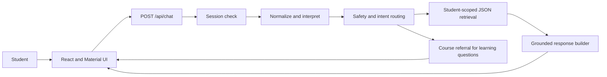

# Student Support Copilot — Tech Stack and How It Works

## Tech stack

| Layer | Technology | Purpose |
|---|---|---|
| Application | Next.js App Router | Hosts the frontend and server API in one deployable application |
| Language | TypeScript | Provides typed UI, API, session, intent, and data contracts |
| Frontend | React and Material UI | Builds the responsive login, objective tiles, chat thread, and composer |
| API | Next.js Route Handlers | Keeps authentication, policy, retrieval, and model calls server-side |
| Authentication | HTTP-only demo cookie | Restricts the prototype to signed-in demo students |
| Language understanding | Local normalization with optional OpenAI | Handles common variations while retaining deterministic fallback |
| Routing | Regex and policy rules | Classifies supported intents and enforces the no-tutoring boundary |
| Retrieval | Local JSON | Simulates curriculum, student, assignment, grade, FAQ, and mentor records |
| Response generation | Deterministic formatter with optional OpenAI | Produces grounded responses without making the model a source of truth |
| Evaluation | TypeScript evaluation script | Tests functionality, privacy, language variation, and policy behavior |
| Deployment | Vercel | Builds and hosts the Next.js application and server routes |

## Project structure

```text
src/
├── app/
│   ├── api/auth/          Demo login, logout, and session routes
│   ├── api/chat/          Authenticated chat endpoint
│   └── page.tsx           Application entry page
├── components/
│   ├── AppShell.tsx       Theme and session state
│   ├── StudentLogin.tsx   Login interface
│   └── ChatApp.tsx        Objective tiles and chat interface
└── lib/
    ├── auth.ts            Session lookup
    ├── understand.ts      Message normalization and optional LLM hints
    ├── intent.ts          Deterministic intent classification
    ├── retrieve.ts        Student-scoped data retrieval
    ├── prompts.ts         Grounded response instructions and fallback formatting
    └── chat.ts            Main orchestration pipeline

data/                     Synthetic LMS records
scripts/evaluation.mts    Automated behavior evaluation
```

## End-to-end request flow



### 1. Session check

`AppShell.tsx` calls `/api/auth/me` when the application loads. Signed-out users see
`StudentLogin.tsx`; signed-in users see `ChatApp.tsx`.

The chat API reads the student identity from the HTTP-only cookie. The browser does not send a
student ID with the question, which prevents users from selecting another student's record.

### 2. Objective selection

`ChatApp.tsx` presents five information objectives:

- My courses
- Assignments
- Grades & progress
- Get support
- Find where a topic is taught

The selected objective is sent as a routing hint. It does not override explicit intent or safety
rules.

### 3. Chat API

`src/app/api/chat/route.ts`:

1. rejects unauthenticated requests;
2. validates the message and optional scope;
3. calls `handleChatMessage`;
4. logs non-sensitive routing metadata; and
5. returns only the reply and source to the frontend.

### 4. Language understanding

`understand.ts` first applies local normalization for known slang, typos, fragments, and supported
Hindi-English phrases.

When `OPENAI_API_KEY` is configured, OpenAI may return structured hints:

- normalized text;
- intent hints;
- course and topic hints;
- confidence; and
- whether clarification is needed.

The application validates this JSON. Unknown intents, malformed values, and low-confidence hints are
discarded.

### 5. Policy and intent routing

`chat.ts` and `intent.ts` evaluate the original message before retrieval. They handle:

- distress and human escalation;
- off-topic questions;
- vague requests;
- multi-intent questions;
- curriculum, assignment, grade, FAQ, and mentor intents; and
- concept, definition, and homework requests.

Academic questions enter the referral path and cannot request instructional generation.

### 6. Retrieval

`retrieve.ts` loads only the records needed for the detected intent. It applies:

- authenticated student filtering;
- enrollment filtering;
- course and topic matching;
- assignment date and submission filters; and
- honest unavailable states.

Structured records use direct lookup because grades and deadlines require exact values. Vector
similarity is intentionally not used for these facts.

### 7. Grounded response

`prompts.ts` converts retrieved snippets into a concise fallback response. If OpenAI is available,
the same approved snippets may be formatted into more natural wording.

The model cannot retrieve arbitrary data and is instructed not to add unsupported facts. If the
model call fails, the deterministic response is returned.

### 8. Frontend rendering

The API returns:

```json
{
  "reply": "Grounded response",
  "source": "Source category"
}
```

`ChatApp.tsx` adds the response to the conversation and displays its source.

## Environment variables

```text
OPENAI_API_KEY=optional-secret-key
OPENAI_MODEL=gpt-4o-mini
```

The application works without OpenAI by using local understanding and deterministic responses.
Secrets remain server-side and must never use the `NEXT_PUBLIC_` prefix.

## Verification

```bash
npm run evaluate
npx tsc --noEmit
npm run build
```

The evaluation suite covers 34 supported, privacy, fallback, language-variation, and
academic-integrity scenarios.

## Prototype-to-production changes

- Replace the demo cookie with signed OIDC/SSO.
- Replace JSON files with authenticated LMS APIs.
- Add rate limiting and production observability.
- Redact or avoid sensitive model inputs based on the approved AI data policy.
- Add instructor-owned course mappings and support-content review workflows.
