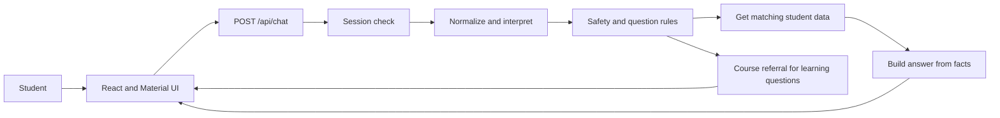

# Student Support Copilot — Tech Stack and How It Works

## Tech stack

| Layer | Technology | Purpose |
|---|---|---|
| Application | Next.js App Router | Hosts the frontend and server API in one deployable application |
| Language | TypeScript | Helps catch code and data mistakes before deployment |
| Frontend | React and Material UI | Builds the responsive login, objective tiles, chat thread, and composer |
| API | Next.js Route Handlers | Keeps authentication, policy, retrieval, and model calls server-side |
| Authentication | HTTP-only demo cookie | Restricts the prototype to signed-in demo students |
| Language understanding | Local text cleanup with optional OpenAI | Handles common wording, slang, and typos with a built-in backup |
| Question handling | Text and safety rules | Finds the question type and blocks tutoring requests |
| Retrieval | Local JSON | Simulates curriculum, student, assignment, grade, FAQ, and mentor records |
| Response writing | Built-in formatter with optional OpenAI | Uses retrieved facts and does not treat AI as the source of truth |
| Evaluation | TypeScript evaluation script | Tests functionality, privacy, language variation, and policy behavior |
| Deployment | Vercel | Builds and hosts the Next.js application and server routes |

## Project structure

```text
src/
├── app/
│   ├── api/auth/          Demo login, logout, and session routes
│   ├── api/chat/          Chat endpoint that requires login
│   └── page.tsx           Application entry page
├── components/
│   ├── AppShell.tsx       Theme and session state
│   ├── StudentLogin.tsx   Login interface
│   └── ChatApp.tsx        Objective tiles and chat interface
└── lib/
    ├── auth.ts            Session lookup
    ├── understand.ts      Cleans the message and gets optional AI hints
    ├── intent.ts          Finds the question type using rules
    ├── retrieve.ts        Gets only the signed-in student's data
    ├── prompts.ts         Response instructions and backup wording
    └── chat.ts            Connects all chat steps

data/                     Made-up LMS records for the demo
scripts/evaluation.mts    Automated behavior evaluation
```

## End-to-end request flow



### 1. Session check

`AppShell.tsx` calls `/api/auth/me` when the application loads. Signed-out users see
`StudentLogin.tsx`; signed-in users see `ChatApp.tsx`.

The chat API reads the student identity from the HTTP-only cookie. The browser does not send a
student ID with the question, which prevents users from selecting another student's record.

### 2. Objective selection

`ChatApp.tsx` presents five information objectives:

- My courses
- Assignments
- Grades & progress
- Get support
- Find where a topic is taught

The selected objective helps the system understand the question. The student's actual words and
safety rules always take priority.

### 3. Chat API

`src/app/api/chat/route.ts`:

1. rejects requests from users who are not signed in;
2. checks the message and selected objective;
3. calls `handleChatMessage`;
4. logs basic technical details without the full student message; and
5. returns only the reply and source to the frontend.

### 4. Language understanding

`understand.ts` first cleans up known slang, typos, short phrases, and supported Hindi-English
phrases.

When `OPENAI_API_KEY` is configured, OpenAI may return structured hints:

- cleaned text;
- possible question types;
- course and topic hints;
- confidence; and
- whether clarification is needed.

The application checks this JSON. Unknown, broken, or uncertain values are ignored.

### 5. Safety and question handling

`chat.ts` and `intent.ts` evaluate the original message before retrieval. They handle:

- distress and human escalation;
- off-topic questions;
- vague requests;
- questions that ask for two things;
- course, assignment, grade, common-question, and support requests; and
- concept, definition, and homework requests.

Academic questions enter the referral path and cannot request instructional generation.

### 6. Retrieval

`retrieve.ts` loads only the records needed for the question. It checks:

- signed-in student filtering;
- enrollment filtering;
- course and topic matching;
- assignment date and submission filters; and
- honest unavailable states.

Grades and deadlines use direct matching because their values must be exact. The system does not use
approximate AI search for these facts.

### 7. Answer based on retrieved facts

`prompts.ts` converts retrieved snippets into a concise fallback response. If OpenAI is available,
the same approved snippets may be formatted into more natural wording.

The model cannot search other data and must not add unsupported facts. If the model call fails, the
built-in response is returned.

### 8. Frontend rendering

The API returns:

```json
{
  "reply": "Answer based on retrieved facts",
  "source": "Source category"
}
```

`ChatApp.tsx` adds the response to the conversation and displays its source.

## Environment variables

```text
OPENAI_API_KEY=optional-secret-key
OPENAI_MODEL=gpt-4o-mini
```

The application works without OpenAI by using local rules and built-in responses.
Secrets remain server-side and must never use the `NEXT_PUBLIC_` prefix.

## Verification

```bash
npm run evaluate
npx tsc --noEmit
npm run build
```

The evaluation suite covers 34 feature, privacy, fallback, language, and learning-safety scenarios.

## Prototype-to-production changes

- Replace the demo cookie with the school's secure sign-in system.
- Replace JSON files with secure LMS APIs.
- Limit repeated API requests and add error and usage tracking.
- Remove sensitive details before sending approved data to an AI provider.
- Add instructor-owned course mappings and support-content review workflows.
